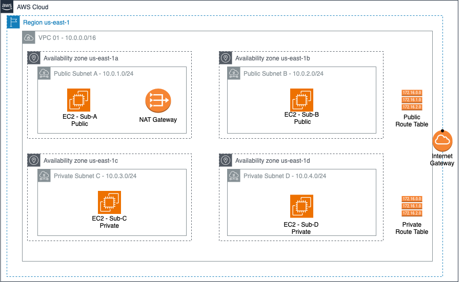

AWS Architectur: Public and Private subnets and EC2 Instances
====================================================================

This is a Terraform example for an AWS Architecture, using 4 availability zones, which one with a subnet, two public and two private.

